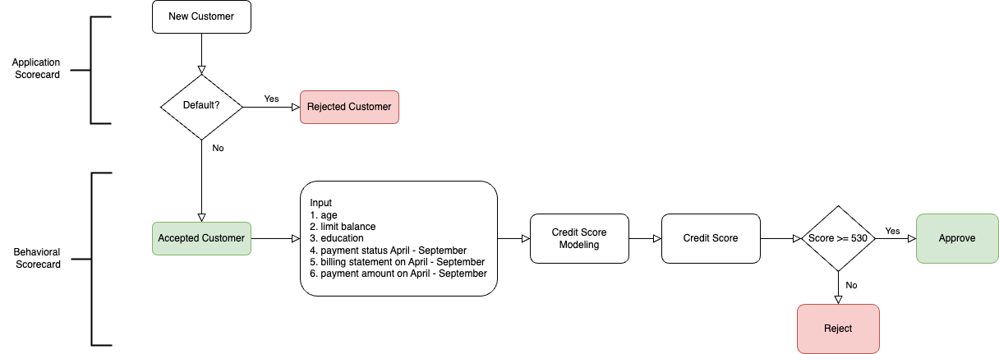

# scorecard_python

Credit Scorecard built from Taiwan's behavioral credit dataset modeled using logistic regression. The dataset contains information on default payments, demographic factors, credit data, history of payments, and bill statements of credit card clients in Taiwan from April 2005 to September 2005.

- Deployed web app: https://scorecard-dashboard.streamlit.app/

